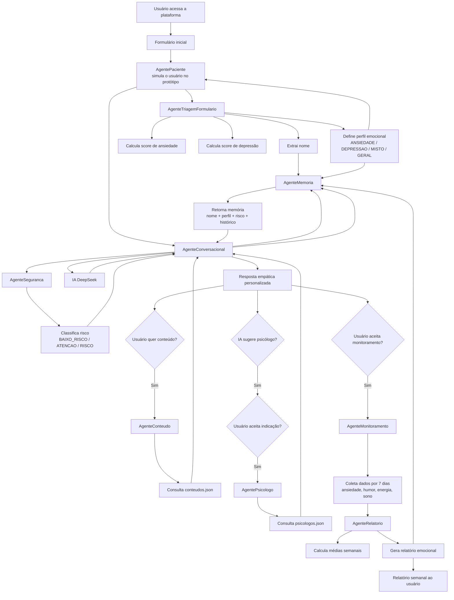

# Plataforma Multiagente de Apoio à Saúde Mental

## Visão Geral

Este projeto consiste em uma plataforma inteligente de apoio emocional baseada em Sistemas Multiagentes utilizando JADE (Java Agent Development Framework), com integração de Inteligência Artificial para respostas empáticas e personalizadas.

O sistema foi desenvolvido com foco em:

* apoio emocional inicial;
* acompanhamento contínuo;
* personalização da experiência do usuário;
* recomendação de conteúdos;
* indicação de profissionais;
* geração automática de relatórios emocionais.

A plataforma não substitui acompanhamento psicológico profissional, atuando como um sistema de apoio e acolhimento inicial.

---

# Objetivo do Projeto

O objetivo principal do sistema é oferecer:

* acolhimento emocional inicial;
* acompanhamento do estado emocional do usuário;
* personalização baseada em perfil emocional;
* apoio por meio de conteúdos terapêuticos;
* encaminhamento opcional para psicólogos cadastrados;
* monitoramento contínuo com geração de relatórios.

---

# Arquitetura Geral do Sistema



---

# Fluxo Principal da Plataforma

## 1. Entrada do Usuário

O usuário acessa a plataforma e responde um formulário emocional inicial contendo:

* nome;
* preocupação;
* nervosismo;
* relaxamento;
* sono;
* tristeza;
* energia;
* interesse;
* isolamento.

Essas informações são utilizadas para identificação inicial do perfil emocional.

---

## 2. Triagem Emocional

O formulário é enviado ao AgenteTriagemFormulario.

O agente realiza:

* cálculo de score de ansiedade;
* cálculo de score de depressão;
* classificação do perfil emocional.

Perfis possíveis:

* ANSIEDADE
* DEPRESSAO
* MISTO
* GERAL

---

## 3. Conversa com IA

Após a triagem, o usuário inicia uma conversa com o AgenteConversacional.

O agente:

* consulta memória;
* analisa risco emocional;
* gera prompt contextual;
* utiliza IA da NVIDIA;
* produz resposta empática personalizada.

---

## 4. Segurança Emocional

O AgenteSeguranca analisa mensagens em busca de sinais de risco.

Classificações:

* BAIXO_RISCO
* ATENCAO
* RISCO

Em casos críticos:

* o sistema prioriza orientação profissional;
* reduz respostas genéricas;
* aumenta foco em acolhimento.

---

## 5. Sugestão de Conteúdos

O sistema pergunta se o usuário deseja receber conteúdos de apoio.

Caso aceite:

* o AgenteConteudo consulta a base conteudos.json;
* conteúdos são selecionados conforme perfil emocional.

Exemplos:

* meditação;
* respiração guiada;
* músicas relaxantes;
* exercícios leves;
* textos motivacionais.

---

## 6. Sugestão de Psicólogos

A IA pode sugerir automaticamente a possibilidade de conversar com um psicólogo dependendo:

* do perfil emocional;
* do nível de risco;
* do contexto da conversa.

Caso o usuário aceite:

* o AgentePsicologo consulta psicologos.json;
* profissionais compatíveis são sugeridos.

---

## 7. Monitoramento Contínuo

O usuário pode optar por acompanhamento diário.

O AgenteMonitoramento:

* envia perguntas emocionais;
* coleta dados diários;
* acompanha evolução emocional.

Dados monitorados:

* ansiedade;
* humor;
* energia;
* sono.

---

## 8. Geração de Relatórios

O AgenteRelatorio recebe os dados semanais.

O agente:

* calcula médias emocionais;
* identifica padrões;
* gera resumo semanal;
* produz recomendações.

---

# Estrutura dos Agentes

## AgentePaciente

Responsável por:

* simular interação do usuário;
* responder formulário;
* iniciar conversa;
* aceitar ou recusar monitoramento.

---

## AgenteTriagemFormulario

Responsável por:

* analisar formulário emocional;
* calcular scores;
* definir perfil emocional.

---

## AgenteConversacional

Principal agente do sistema.

Responsável por:

* conversar com usuário;
* integrar IA;
* consultar memória;
* consultar segurança;
* oferecer conteúdos;
* sugerir psicólogos;
* iniciar monitoramento.

---

## AgenteMemoria

Responsável por:

* armazenar nome;
* armazenar perfil;
* armazenar histórico;
* armazenar risco;
* disponibilizar contexto para IA.

---

## AgenteSeguranca

Responsável por:

* identificar risco emocional;
* detectar mensagens sensíveis;
* aumentar prioridade de encaminhamento.

---

## AgenteConteudo

Responsável por:

* sugerir conteúdos terapêuticos;
* consultar base JSON;
* personalizar recomendações.

---

## AgentePsicologo

Responsável por:

* sugerir psicólogos;
* consultar base JSON;
* recomendar profissionais conforme perfil.

---

## AgenteMonitoramento

Responsável por:

* realizar acompanhamento contínuo;
* coletar indicadores emocionais;
* enviar dados ao relatório.

---

## AgenteRelatorio

Responsável por:

* gerar resumo emocional semanal;
* calcular médias emocionais;
* produzir recomendações.

---

# Estrutura das Bases JSON

## conteudos.json

Base de conteúdos emocionais.

Estrutura:

```json
[
  {
    "perfil": "MISTO",
    "titulo": "Meditacao curta",
    "link": "https://youtube.com"
  }
]
```

---

## psicologos.json

Base de profissionais cadastrados.

Estrutura:

```json
[
  {
    "nome": "Dra. Juliana",
    "especialidade": "MISTO",
    "modalidade": "online"
  }
]
```

---

# Tecnologias Utilizadas

## Linguagem

* Java

## Framework Multiagente

* JADE

## Inteligência Artificial

* Depeesek

## Estrutura de Dados

* JSON

## Build

* Maven

## IDE

* VS Code

---

# Diferenciais do Projeto

## Uso de Sistemas Multiagentes

O sistema é dividido em agentes especializados.

Isso permite:

* modularidade;
* escalabilidade;
* separação de responsabilidades;
* inteligência distribuída.

---

## Personalização

As respostas são personalizadas utilizando:

* memória;
* histórico;
* perfil emocional;
* contexto da conversa.

---

## Integração com IA

O sistema utiliza IA para:

* respostas naturais;
* acolhimento emocional;
* análise contextual.

---

## Acompanhamento Contínuo

A plataforma não atua apenas em uma conversa isolada.

Ela acompanha:

* evolução emocional;
* padrões emocionais;
* mudanças de comportamento.

---

# Conclusão

O projeto apresenta uma arquitetura inteligente baseada em sistemas multiagentes aplicados à saúde mental digital.

A plataforma integra:

* IA;
* memória contextual;
* acompanhamento emocional;
* recomendação de conteúdos;
* encaminhamento profissional.

O sistema demonstra forte potencial acadêmico e prático, podendo evoluir futuramente para uma solução real de apoio emocional digital.
